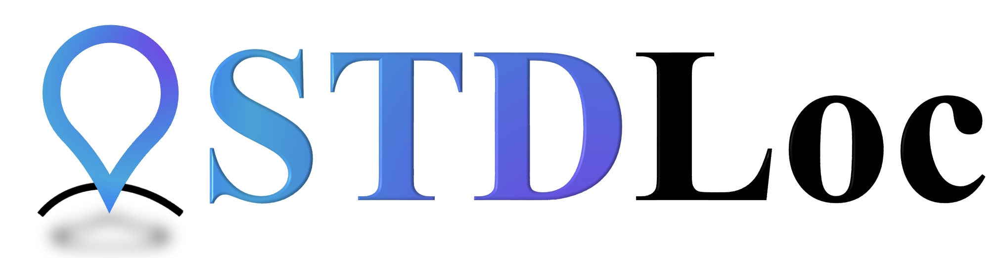
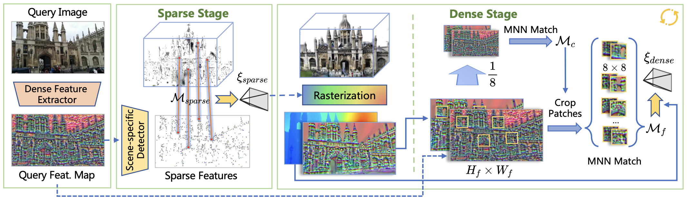

<br>
<p align="center">
</img>
<h1 align="center"><strong>From Sparse to Dense: Camera Relocalization with Scene-Specific Detector from Feature Gaussian Splatting</strong></h1>
  <p align="center">
    <a href='' target='_blank'>Zhiwei Huang<sup>1,2</sup><sup>*</sup></a>&emsp;
    <a href='' target='_blank'>Hailin Yu<sup>2</sup><sup>*</sup><sup>&dagger;</sup></a>&emsp;
    <a href='' target='_blank'>Yichun Shentu<sup>2</sup></a>&emsp;
    <a href='' target='_blank'>Jin Yuan<sup>2</sup></a>&emsp;
    <a href='' target='_blank'>Guofeng Zhang<sup>1,2</sup><sup>&dagger;</sup></a>&emsp;
    <br>
    <sup>1</sup>State Key Lab of CAD&CG, Zhejiang University&emsp;<sup>2</sup>SenseTime Research
    <br>
    <sup>*</sup> Equal Contribution
    <sup>&dagger;</sup> Corresponding Authors
    <br>
    <strong style="font-size: 20px; color:rgb(219, 39, 119);"> CVPR2025 </strong>
  </p>
</p>

<p align="center">
  <a href="" target='_**blank**'>
    
  </a> 
  <a href="" target='_blank'>
    
  </a> 
  <a href="https://zju3dv.github.io/STDLoc/" target='_blank'>
    
  </a>
  <a href="" target='_blank'>
    
  </a>
</p>

## 🏠 About
<div style="text-align: center;">
    
</div>
This paper presents a novel camera relocalization method, <b>STDLoc</b>, which leverages Feature GS as scene representation. STDLoc is a full relocalization pipeline that can achieve accurate relocalization without relying on any pose prior. Unlike previous coarse-to-fine localization methods that require image retrieval first and then feature matching, we propose a novel sparse-to-dense localization paradigm. Based on this scene representation, we introduce a novel matching-oriented Gaussian sampling strategy and a scene-specific detector to achieve efficient and robust initial pose estimation. Furthermore, based on the initial localization results, we align the query feature map to the Gaussian feature field by dense feature matching to enable accurate localization. The experiments on indoor and outdoor datasets show that <b>STDLoc outperforms current state-of-the-art localization methods in terms of localization accuracy and recall</b>.


<!-- contents with emoji -->
<!-- ## 📋 Contents
- [🔍 Overview](#-overview)
- [📦 Training and Evaluation](#-training-and-evaluation)
- [🔗 Citation](#-citation)
- [👏 Acknowledgements](#-acknowledgements) -->

## 🔍 Performance


The code in this repository has a better performance than our paper, through some small fix:
1. Set ```align_corners=False``` in interpolation.
2. Use a smaller learning rate for ourdoor dataset.
3. Use the anti-aliasing feature of gsplat.

#### 7-Scenes
| Method | Chess | Fire | Heads | Office | Pumpkin | Redkitchen | Stairs | Avg.↓[cm/◦] |
|---|---|---|---|---|---|---|---|---|
| STDLoc (paper) | 0.46/0.15 | 0.57/0.24 | 0.45/0.26 | 0.86/0.24 | 0.93/0.21 | 0.63/0.19 | 1.42/0.41 | 0.76/0.24 |
| STDLoc (repo) | 0.42/0.13 | 0.49/0.2 | 0.41/0.26 | 0.74/0.21 | 0.89/0.23 | 0.57/0.14 | 1.18/0.35 | 0.67/0.22 |


#### Cambridge Landmarks
| Methods | Court | King’s | Hospital | Shop | St. Mary’s | Avg.↓[cm/◦] |
|---|---|---|---|---|---|---|
| STDLoc (paper) | 15.7/0.06 | 15.0/0.17 | 11.9/0.21 | 3.0/0.13 | 4.7/0.14 | 10.1/0.14 |
| STDLoc (repo) | 11.3/0.05 | 15.0/0.15 | 11.3/0.21 | 2.5/0.12 | 3.6/0.12 | 8.7/0.13 |

## 📦 Training and Evaluation
### Environment Setup

1. Clone this repository.
```bash
git clone --recursive https://github.com/zju3dv/STDLoc.git
```
2. Install packages
```bash
conda create -n stdloc python=3.8 -y
pip install torch==2.4.1 torchvision==0.19.1 torchaudio==2.4.1 --index-url https://download.pytorch.org/whl/cu124 
pip install -r requirements.txt
# install gsplat
cd submodules/gsplat
pip install -e .
cd ../..
```

### Data Preparation
We use two public datasets:
- [Microsoft 7-Scenes](https://www.microsoft.com/en-us/research/project/rgb-d-dataset-7-scenes/)
- [Cambridge Landmarks](https://www.repository.cam.ac.uk/handle/1810/251342/)

#### 7-Scenes Dataset
1. Download images follow HLoc.
```bash
export dataset=datasets/7scenes
for scene in chess fire heads office pumpkin redkitchen stairs; \
do wget http://download.microsoft.com/download/2/8/5/28564B23-0828-408F-8631-23B1EFF1DAC8/$scene.zip -P $dataset \
&& unzip $dataset/$scene.zip -d $dataset && unzip $dataset/$scene/'*.zip' -d $dataset/$scene; done
```

2. Download Full Reconstructions
 from [visloc_pseudo_gt_limitations](https://github.com/tsattler/visloc_pseudo_gt_limitations/tree/main?tab=readme-ov-file#full-reconstructions):
```bash
pip install gdown
gdown 1ATijcGCgK84NKB4Mho4_T-P7x8LSL80m $dataset/7scenes_reference_models.zip
unzip $dataset/7scenes_reference_models.zip -d $dataset
# move sfm_gt to each dataset
for scene in chess fire heads office pumpkin redkitchen stairs; \
do mkdir -p $dataset/$scene/sparse && cp -r $dataset/7scenes_reference_models/$scene/sfm_gt $dataset/$scene/sparse/0 ; done
```

<!-- 3. Generate test files -->

#### Cambridge Landmarks Dataset
1. Download the dataset from the PoseNet project page:
```bash
export dataset=datasets/cambridge
export scenes=( "KingsCollege" "OldHospital" "StMarysChurch" "ShopFacade" "GreatCourt" )
export IDs=( "251342" "251340" "251294" "251336" "251291" )
for i in "${!scenes[@]}"; do
wget https://www.repository.cam.ac.uk/bitstream/handle/1810/${IDs[i]}/${scenes[i]}.zip -P $dataset \
&& unzip $dataset/${scenes[i]}.zip -d $dataset ; done
```


2. Install Mask2Former to mask dynamic objects and sky:
```bash
cd submodules/Mask2Former
pip install -r requirements.txt
wget https://dl.fbaipublicfiles.com/maskformer/mask2former/coco/panoptic/maskformer2_swin_large_IN21k_384_bs16_100ep/model_final_f07440.pkl
cd ../..
```

3. Preprocess data:
```bash
bash scripts/dataset_preprocess.sh
```


### Training Feature Gaussian
For 7-Scenes: 
```bash
bash scripts/train_7scenes.sh
```
For Cambridge Landmarks: 
```bash
bash scripts/train_cambridge.sh
```
### Evaluation
For 7-Scenes: 
```bash
bash scripts/evaluate_7scenes.sh
```
For Cambridge Landmarks: 
```bash
bash scripts/evaluate_cambridge.sh
```

## 🔗 Citation

```bibtex

```


## 👏 Acknowledgements
- [Feature 3DGS](https://github.com/ShijieZhou-UCLA/feature-3dgs): Our codebase is built upon Feature 3DGS.
- [gsplat](https://github.com/nerfstudio-project/gsplat): We use gsplat as our rasterization backend.
